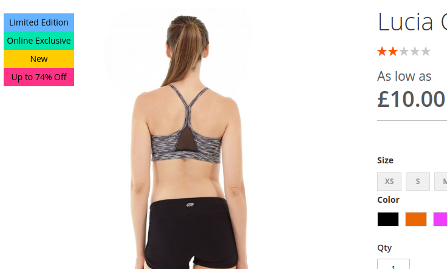

# Magento 2 Product Labels

This is an extension for Magento 2 ONLY. It allows you to display Labels overlayed on top of the product image which callout certain things about the product. Currently It will display a label if the product is new, on sale, set as an online exclusive or limited edition. Labels will stack on top of each other if multiple labels are valid to show for that product. The colors are customizable in the admin panel and the labels are able to be globally disabled if you dont want them showing.



## Getting setup

Before installing the files for the extension go into your magento 2 admin panel and set up x2 new product attributes. Both attributes need to be Yes/No attributes, one should have a attribute code of ```online``` and the other ```limited```. You can call the label of each of these attributes what you like however to match the label that displays in the product it is recommended to set them to ```Online Exclusive``` and ```Limited Edition```. This will now enable you to set products with this status so when the extension is installed the labels will display.

Next I recommend you fork the extension files to your own github account and then if you need to add extra labels or remove any it makes it easy to modify and maintain to your own needs.

After cloning the fork from your account into the folder ```app/code/TPB``` you will need to run ```php bin/magento setup:upgrade``` to install the extension. 

After thats done you can flush the cache from the command line like so ```php bin/magento cache:flush``` and then it should just work.

## How the new and sale label work

The new and sale label are different from the online exclusive and limited edition ones. The latter are simply toggled on and off per product where as the new and sale labels work with logic. The new one checks the ```new from date``` and the ```new to date```, if the current date falls between those restrictions then the new label shows. The sale label checks the original price and the special price including the ```special from date``` and the ```special to date``` and if the current date falls within those restrictions then it will calculate the percentage reduction and display it in the sale label.

# Support

> - NOTE: This extension is provided under the MIT license and I do not accept any responsability for any problems you encounter when using it
> - NOTE: This was designed for the LUMA theme and works fine with Magento 2 out of the box, I cannot help with any situations where the extension does not work with a custom theme or has conflicting extensions

If you have any questions or improvment suggestions please submit them as an issue. Any bugs you find then also please submit them as an issue with a detailed explination of how to replicate the problem and I will endevour to do my best to help.
